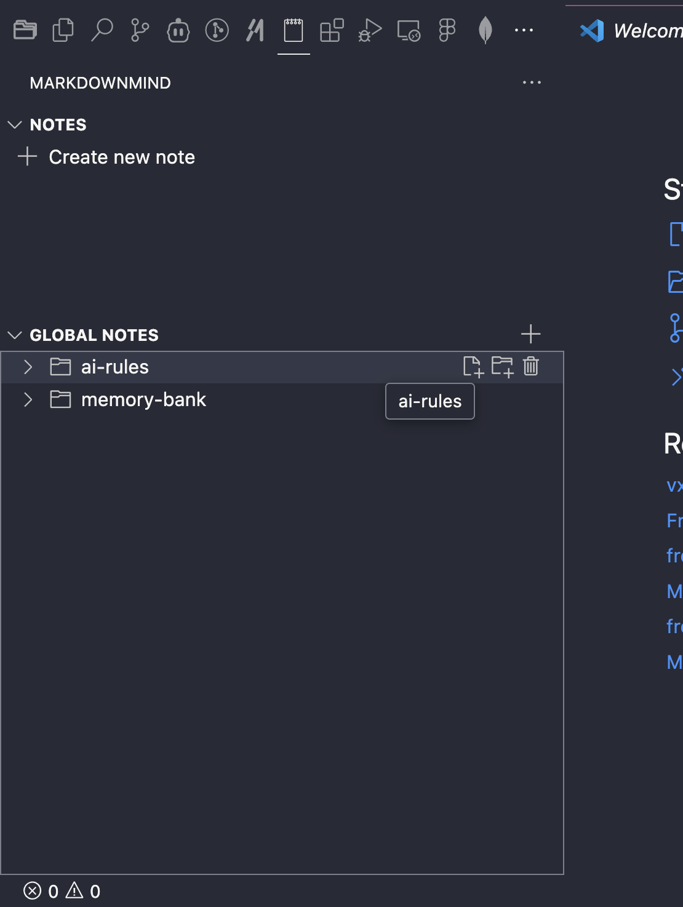
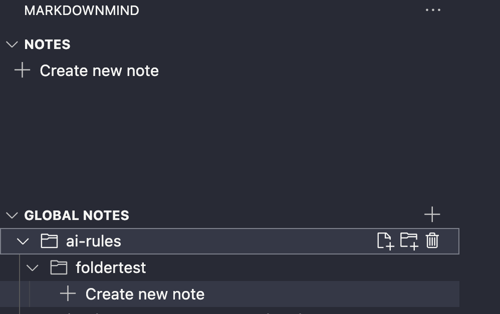

# 🧠 MarkdownMind

> Transform your thoughts into organized knowledge, right within VS Code.

MarkdownMind transforms VS Code into your ultimate knowledge workspace. Seamlessly capture ideas, documentation, and code snippets with powerful Markdown support - all while staying in your favorite editor.

## ✨ Why MarkdownMind?

- **Stay in Flow**: Take notes without leaving your development environment
- **Flexible Storage**: Choose between project-specific or global notes
- **Full Markdown Power**: Write with complete Markdown capabilities
- **Smart Organization**: Create nested structures that match your thinking

## 🚀 Features

### 📝 Core Note-Taking
- **Quick Note Creation**: Create new notes with just a few clicks
- **Instant Focus**: Automatically opens new notes for immediate writing
- **Rich Text Support**: Write in Markdown with full syntax support
- **Live Preview**: See your formatted text as you write

### 🗂️ Smart Organization
- **Dual Storage System**
  - Local project notes in `.mdnotes` folder
  - Global notes accessible across all projects
- **Folder Structures**
  - Create nested folders for better organization
  - Move notes between folders easily
  - Custom folder hierarchies
- **Quick Navigation**
  - Fast note switching
  - Search through all notes
  - Recent notes access

### 💫 Markdown Enhancements
- **Syntax Highlighting**: Language-specific code blocks
- **Table Support**: Create and format tables easily
- **Link Integration**: Internal and external link support
- **List Management**: Nested lists and task lists
- **Math Equations**: LaTeX-style math formatting
- **Diagrams**: Mermaid diagram support
- **Images**: Drag & drop image insertion

### ⚡ Power Features
- **Version Control Integration**: Notes tracked with your project
- **Custom Templates**: Create notes from templates
- **Note Refactoring**: Rename and restructure with ease
- **Auto-save**: Never lose your thoughts
- **File Attachments**: Link to external resources
- **Export Options**: Convert to PDF, HTML, and more
- **Command Palette Integration**: Quick actions via commands

## 🎯 Getting Started

1. **Install**: Get MarkdownMind from the VS Code marketplace
2. **Access**: Click the 🧠 MarkdownMind icon in the activity bar
3. **Choose Storage**:
   - 📁 Project Notes (`.mdnotes` folder)
   - 🌐 Global Notes (accessible everywhere)
4. **Create**: Click `+` to start a new note
5. **Organize**: Create folders and structure your knowledge
6. **Write**: Enjoy the full power of Markdown

## ⚙️ Configuration

- **Storage Locations**: Customize where your notes are stored
- **Default Templates**: Set up templates for different note types
- **Auto-save Interval**: Configure how often notes are saved
- **Preview Settings**: Customize how your Markdown renders
- **Keyboard Shortcuts**: Customize your workflow

## 🛠️ Requirements

- VS Code 1.75.0 or higher
- Internet connection for some features (like image uploads)

## 🤝 Contributing

We love your input! Check out our [contribution guidelines](CONTRIBUTING.md) to get started.

## 📜 License

MarkdownMind is [MIT licensed](LICENSE).

## 🔗 Resources

- [Documentation](https://github.com/alioshromano/markdown-mind/wiki)
- [Issue Tracker](https://github.com/alioshromano/markdown-mind/issues)
- [Release Notes](CHANGELOG.md)
- [Support](https://github.com/alioshromano/markdown-mind/discussions)

---

<strong>Elevate your note-taking game with MarkdownMind</strong> 
Where thoughts meet code 🧠✨

